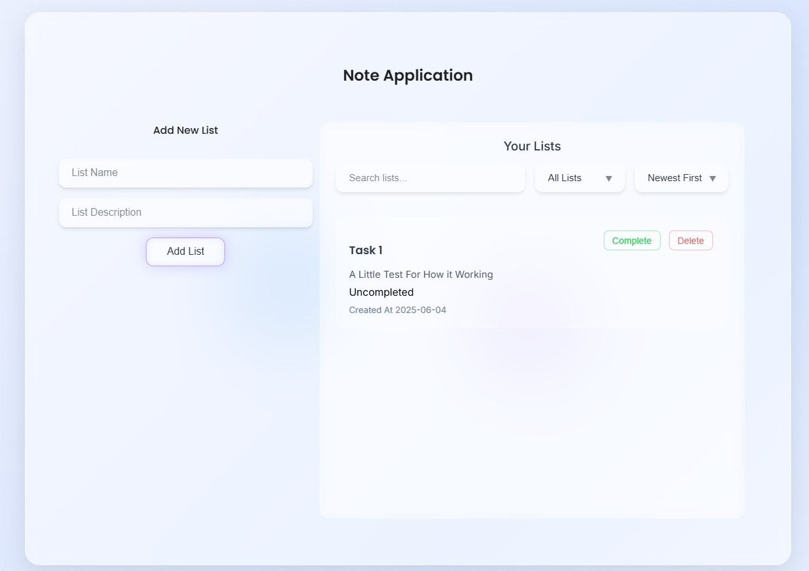

# 📒 Simple Note App (Vanilla JS + Glassmorphism UI)

A clean and responsive note-taking application built using **HTML**, **CSS**, and **Vanilla JavaScript**. Designed with a modern **Glassmorphism** style, this app allows users to create, manage, and browse notes in a beautiful and minimal interface.

> Notice = In this project used a little help from AI to design.

> 🔹 No frameworks.  
> 🔹 No libraries.  
> 🔹 No data persistence.  
> Just pure front-end magic.

---

## ✨ Features

- 📝 Add new notes with title and description
- 🔍 Search through your notes
- 📂 Filter and sort notes by category or creation time
- 💎 Elegant **Glassmorphism** UI
- ⚡ Fast and lightweight – built with Vanilla JavaScript

---

## 🖼️ Screenshot



---

## 🚀 How to Use

1. **Clone the repository**

   ```bash
   git clone https://github.com/yourusername/note-app-vanilla-js.git
   cd note-app-vanilla-js
   ```
